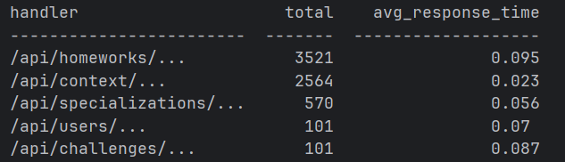
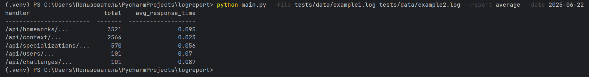
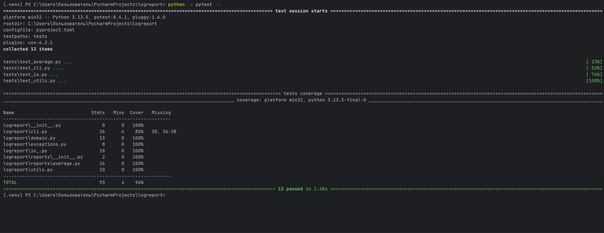

# LogReport

### Python CLI-утилита для анализа логов в формате JSON и формирования отчетов по API-эндпоинтам.

### Пример запуска:

bash:

python main.py --file tests/data/example1.log tests/data/example2.log --report average --date 2025-06-22

### Пример вывода:

### Пример запуска в терминале:

## Аргументы CLI
    Аргумент	    Обязательный	                        Описание
    --files             ✅                           Один или несколько путей к лог-файлам

    --report            ✅                     Название отчёта. Сейчас поддерживается только average

    --date              ❌                       (опционально) фильтрация записей по дате в формате
                                                                    YYYY-MM-DD

## 📂 Структура проекта:

    logreport/
    │   ├── __init__.py
    │   ├── cli.py
    │   ├── domain.py
    │   ├── io.py
    │   ├── exceptions.py
    │   └── reports/
    │       ├── __init__.py
    │       └── average.py
    │
    ├── tests/
    │   ├── test_average.py
    │   ├── test_cli.py
    │   ├── test_io.py
    │   └── test_utils.py
    ├── main.py
    ├── .gitignore
    ├── .pre-commit-config.yaml
    ├── pyproject.toml
    ├── requirements.txt
    └── README.md

## Запуск тестов:

    # С установкой pytest и плагинов
    pip install -r requirements-dev.txt

    # Запуск:
    python -m pytest -v

### Пример запуска тестов:

